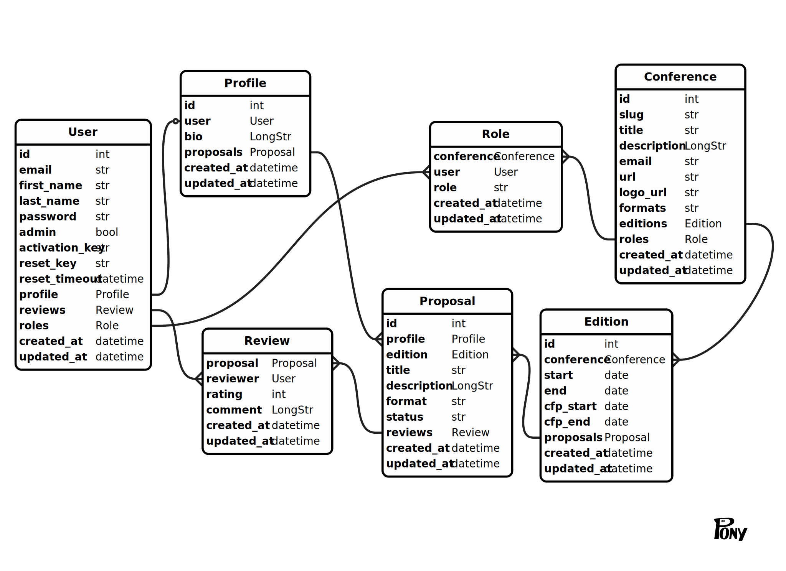

# cfp-node
Call for Proposals - Node-based API server.

## Data Model



_The ERD is maintained in the [online PonyORM editor](https://editor.ponyorm.com/user/helmuthb/CfP)_

## API Endpoints

### Register user

```
POST /user

{
  "email": "user@example.com",
  "password": "abcdef",
  "first_name": "Joe",
  "last_name": "Doe"
}
```
This will create a user object if it does not exist. The user will receive an email asking them to activate their account, to ensure that they do have control over the provided email address.

```
POST /session

{
  "email": "user@example.com",
  "password": "abcdef",
  "activation_key": "12345abcdef"
}
```
This will activate the account. The `activation_key` has to be the same as provided in the activation email to the user.
Also the user will then be logged in.

### Login User

```
POST /session

{
  "email": "user@example.com",
  "password": "abcdef"
}
```
This will login the user.

## Setup

### Prepare Database

Create a PostgreSQL database, together with a user having access to it.
As an example let's assume the database name `cfp-data`.

Now initialize the database with both the session schema (needed by `connect-pg-simple`) and the schema for the cfp application:
```
psql -d cfp-data < node_modules/connect-pg-simple/table.sql
psql -d cfp-data < db/schema.sql
```

### Set Configuration

The recommended way to start the server is using Docker, and to provide the secret parts in the configuration using environment variable.
The following variables can be used:
```
NODE_ENV      environment - either "development" (default), "test", or "production"
PORT          HTTP-Port used (default 3000)
SESSION_KEY   secret key used for encrypting cookies
DB_HOST       PostgreSQL host (default "localhost")
DB_PORT       PostgreSQL port (default 5432)
MAIL_HOST     SMTP-Host
MAIL_PORT     SMTP-Port (default 465)
MAIL_USER     SMTP-User
MAIL_PASSWORD SMTP-Passwort
```

Additionally defaults and further configuration can be set in the file `src/config.js`.

### Start Server

To start the server one can use `node src/index.js`.
